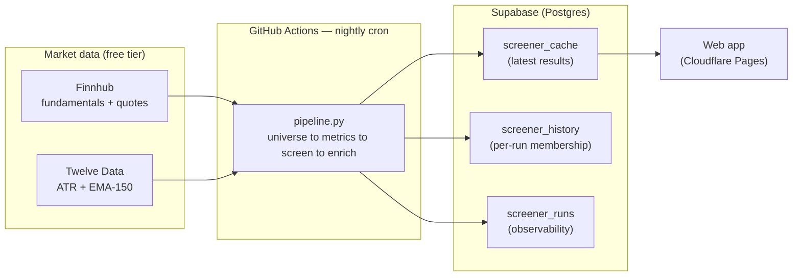

# 📈 Nightly Stock Screener — a live financial data pipeline that runs for $0

A serverless, scheduled data pipeline that screens **the entire NYSE + NASDAQ common-stock universe every night**, ranks names across four strategies, enriches the survivors with volatility and trend indicators, and publishes the results to a database a web app reads from.

It runs **completely free** — no servers, no paid APIs, no paid database — on GitHub Actions' cron, free-tier market-data APIs, Supabase, and Cloudflare.

> **Every night, automatically:**
> | | |
> |---|---|
> | 🌎 Stocks scanned | **~4,945** (full NYSE + NASDAQ common stock) |
> | 🔬 Pass fundamentals | **~2,400** |
> | ✅ Qualify for a screen | **~130** |
> | 📡 API calls per run | **~5,300** → **~160,000 / month** |
> | 🧮 Screening strategies | **4** (growth, refined growth, value, momentum) |
> | ⏱️ Run time | **~2 hours** (rate-limit bound, not compute bound) |
> | 💵 Monthly cost | **$0** |

---

## Architecture



**Why this shape:** the run is a long, rate-limited batch (thousands of tickers against a 60-req/min API → ~2 hours), far past a serverless function's wall-clock limit. So the batch lives on **GitHub Actions cron** (free, unlimited minutes on a public repo), the database is **Supabase** (the app reads from it — the pipeline never serves traffic), and the frontend + lightweight proxies are on **Cloudflare**. Each tier does the one thing it's free and good at.

## How a run works

| Phase | What it does | Cost |
|---|---|---|
| **1 · Universe** | Pull every symbol from Finnhub, keep NYSE/NASDAQ **common stock** (REITs excluded by type), ~$300M market-cap floor | 1 API call |
| **2 · Metrics** | One `/stock/metric` call per ticker → P/E, EPS & revenue growth, EV/EBITDA, FCF growth, P/B, ROE, beta, D/E… then drop names below the cap/volume floor or missing too many fields | ~4,945 calls |
| **3 · Screen** | Tag each survivor against 4 screeners; score within each (min-max **Score**) and against fixed anchors (absolute **Quality** grade) | free (in-memory) |
| **4 · Enrich** | Only for the **~130 that qualify**: live price, 14-day **ATR** (chandelier stops), and **EMA-150** (trend-distance) from Twelve Data | ~390 calls |
| **5 · Publish** | Upsert results + append per-run membership + write a run-metrics row | 3 writes |

The cost-aware bit: expensive per-name data (price, ATR, EMA) is fetched **only for names that survive screening**, not the whole universe — that's the difference between ~5,300 calls/night and ~15,000.

## Engineering decisions worth a look

- **`null = fail`** — every filter field must be present *and* in range; a missing value fails the screen (matches how TradingView treats nulls). Because all fundamentals come from one source, a null means genuinely-missing data, not a flaky enrichment step. ([`screeners.py`](screeners.py))
- **Rate-limit throttling** — Finnhub (60/min) and Twelve Data (8/min, 800/day) each have a token-bucket throttle so a run never trips a limit or incurs a bill. ([`twelvedata.py`](twelvedata.py))
- **Two scores, on purpose** — a relative **Score** (rank within tonight's list) *and* an absolute **Quality** grade (vs fixed benchmarks, comparable across nights). A stock can rank #1 tonight yet be mediocre in absolute terms — both numbers are shown so you can tell.
- **Built-in observability** — every run writes timings + per-API call counts to `screener_runs`, so the web app has a live "System & Cost" page showing exactly what each run sent and how close it got to any free-tier cap.

## Data sources

| Field group | Source | Endpoint |
|---|---|---|
| Universe (exchange, type) | Finnhub (free) | `/stock/symbol` |
| Fundamentals (P/E, growth, P/B, ROE, beta, D/E, EV/EBITDA…) | Finnhub (free) | `/stock/metric?metric=all` |
| FCF growth (derived) | Finnhub (free) | `FCF_TTM / FCF_lastFY − 1` |
| Live price | Finnhub (free) | `/quote` |
| 14-day ATR, EMA-150 | Twelve Data (free) | `/atr`, `/ema` |

> Personal/educational project. Market data is from free-tier APIs under their respective terms; figures may be delayed or inaccurate and nothing here is financial advice.

## Run it locally

```bash
cd screener
pip install -r requirements.txt
export FINNHUB_API_KEY=your_key
export TWELVE_DATA_API_KEY=your_key      # optional; ATR/EMA skipped if absent
# optional: SUPABASE_URL + SUPABASE_SERVICE_ROLE_KEY to publish

python pipeline.py    # one full run → data/results.json (+ publishes if Supabase env is set)
```

## Stack

`Python` · `GitHub Actions` (cron) · `Supabase` (Postgres) · `Cloudflare` (Pages + Workers) · `Finnhub` · `Twelve Data`
